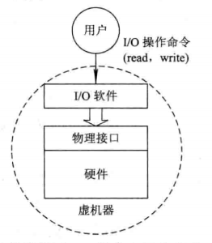
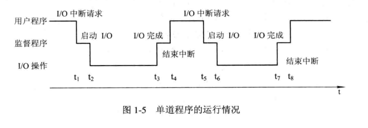
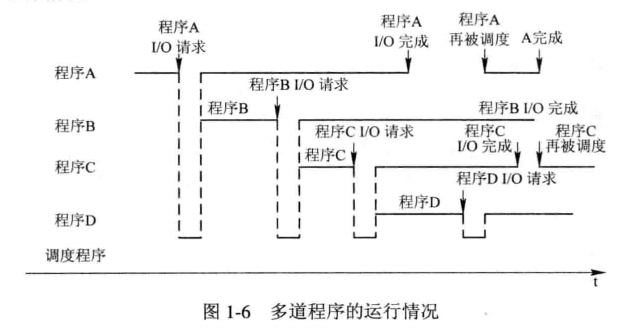

# 1-概述

## 目录结构

* 引论
* 进程描述和控制
* 处理机调度和死锁
* 存储器管理
* 虚拟存储器
* I/O系统
* 文件管理
* 磁盘存储器管理

## 概念

* 何为OS

  * 配置在计算机硬件上的第一层软件
  * 对硬件系统的首次扩充，作用是管理好这些设备，系统资源的管理者
  * 给用户和应用程序系统简单接口
  * 合理的对各类作业进行调度的程序的集合

* OS作用

  * 用户和计算机硬件系统的接口

    

  * 计算机系统资源的管理者

    * 硬件资源和软件资源
    * 通常分为四类
      * 处理机：分配和控制处理机
      * 存储器：负责内存的分配和回收
      * I/O设备：负责I/O设备的分配和操纵
      * 文件：实现对文件的存取、共享和保护

  * 实现了对计算机资源的抽象

    * 完全无软件的计算机系统：裸机
    * 虚机器：在裸机上铺设I/O设备管理软件、文件管理软件等，为用户屏蔽底层细节
       
    * OS是铺设在计算机硬件上的多层软件的集合
      * 增强了系统的功能
      * 隐藏了对硬件操作的具体细节

* 发展历程

  * 人工操作
  * 脱机输入输出（Off-Line I/O）

    * 程序的输入输出都是脱离主机，在外围机控制下完成，又称脱机
  * 单道批处理

    * 把一批作业以脱机方式输入到磁带上，在监督程序控制下，依次处理
     
  * 多道批处理

    * 用户提交的作业放在外存上，排成“后备队列”
    * 作业调度程序按照一定算法，从队列中调出若干作业到内存，使其共享CPU、I/O等系统中其他资源
       
    * 优缺点：资源利用率高、系统吞吐量大、平均周转时间长、无交互能力
    * 需要解决的问题：
       * 处理机争用、内存分配和保护、I/O设备分配
       * 文件组织和管理、作业管理、用户和系统接口
  * 分时系统
    * 一台主机连接了多个终端
    * 允许多个用户同时通过自己的终端以交互的方式使用计算机
  * 实时系统

  

  ## OS特性

  * 并发
    * 并行：多个事件同时发生
    * 并发
      * 一段时间内，宏观上有多个程序同时运行
      * 但在单处理机系统中，程序微观上只能分时交替执行
    * 引入进程
      * 对内存中多个程序分别建立一个进程，可以并发执行
      * 提高资源利用率和系统吞吐量
  * 共享
    * 资源共享/资源复用
    * 系统资源可供内存中多个并发执行的进程使用
      * 时间：进程在内存期间
      * 地点：内存
    * 两种方式
      * 互斥共享
        * 把一段时间内只允许一个进程访问的资源，称为临界资源，如栈、变量、表格
        * 必须有某种机制保证进程互斥地使用临界资源
      * 同时访问
        * 允许一段时间内，由多个进程宏观上 对其进行访问，如磁盘设备
  * 虚拟
    * 定义
      * 通过技术将一个物理实体变为若干个逻辑上的对应物
      * 前者是实际存在的，后者是虚的、用户感觉上的东西
      * 利用时分复用、空分复用实现“虚拟”
  * 异步
    * 不可预知：内存中的进程何时能获得处理机运行、何时暂停、进程以怎样速度推进、程序需要多久完成都是不可预知的，此为进程的异步性

## OS主要功能

### 处理机管理

  处理机分配和运行是以进程为基本单位的，对处理机的管理可归结为对进程的管理

* 进程控制

  * 为作业创建进程、终止已结束进程、控制进程状态转换

* 进程同步

  * 主要任务是为多个进程的运行进行协调
  * 协调方式有
    * 进程互斥方式：访问临界资源，应该采用互斥方式（锁机制）
    * 进程同步方式：相互合作完成任务的进程，由同步机制对其次序加以协调（信号量机制）

* 进程通信

  * 实现相互合作进程之间信息交换
  * 相互合作进程处于同一系统时候，通常采用直接通信方式，即由源进程发送命令直接将消息挂到目标进程的消息队列上，然后由目标进程利用接收命令从其消息队列中取出消息 

* 调度

  * 作业调度：
    * 从后备队列中按照一定的算法选择出若干作业，为他们分配 运行所需资源；
    * 在这些作业调入内存后，分别为他们建立进程，使其都成为就绪进程，将其插入就绪队列中；
  * 进程调度
    * 从进程的就绪队列按照一定算法选出一个进程；
    * 将处理机分配给它，并为其设置运行现场，使其投入运行；

### 存储器管理

* 内存分配
  * 为程序分配内存空间、减少不可用内存空间（碎片）、允许正在运行的程序申请附加空间
  * 两种方式
    * 静态分配：内存空间在作业装入的时候确定，不允许申请新的或者移动
    * 动态分配：内存空间在作业装入的时候确定，但允许继续申请附加内存空间，允许作业在内存中“移动”
* 内存保护
  * 每道用户程序都仅在自己内存空间内运行
  * 不许用户程序访问操作系统的程序和数据，不允许用户程序转移到非共享的其他用户程序中去执行
* 地址映射
  * 将地址空间中的逻辑地址转换成内存空间中的物理地址
* 内存扩充
  * 借助虚拟存储技术，从逻辑上扩充内存容量
  * 设置内存扩充机制，实现：请求调入功能、置换功能

### 设备管理功能

* 主要任务
  * 完成进程提出的I/O请求，分配所需I/O设备，完成指定I/O操作
  * 提高CPU和I/O设备的利用率
* 缓冲管理
  * 
* 设备分配
* 设备处理

​      

  

