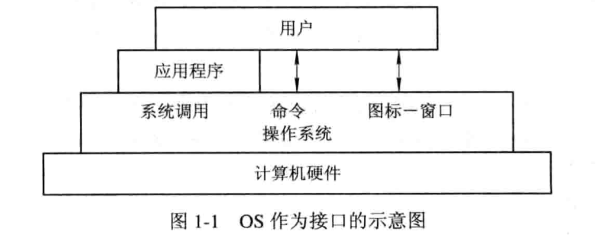

# 1-概述

## 目录结构

* 引论
* 进程描述和控制
* 处理机调度和死锁
* 存储器管理
* 虚拟存储器
* I/O系统
* 文件管理
* 磁盘存储器管理

## 概念

* 何为OS

  * 配置在计算机硬件上的第一层软件
  * 对硬件系统的首次扩充，作用是管理好这些设备，系统资源的管理者
  * 给用户和应用程序系统简单接口

* OS作用

  * 用户和计算机硬件系统的接口

    

  * 计算机系统资源的管理者

    * 硬件资源和软件资源
    * 通常分为四类
      * 处理机：分配和控制处理机
      * 存储器：负责内存的分配和回收
      * I/O设备：负责I/O设备的分配和操纵
      * 文件：实现对文件的存取、共享和保护

  * 实现了对计算机资源的抽象

    * 完全无软件的计算机系统：裸机
    * 虚机器：在裸机上铺设I/O设备管理软件、文件管理软件等，为用户屏蔽底层细节
    * OS是铺设在计算机硬件上的多层软件的集合
      * 增强了系统的功能
      * 隐藏了对硬件操作的具体细节